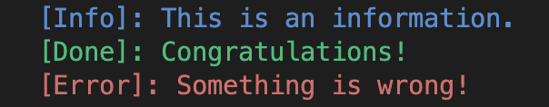
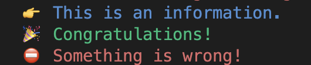

# color loggers

Print to console with colors.

## Install

```
yarn add color-loggers
```

## Use

```ts
import { Blue, Green, Red } from 'color-loggers';

const info = new Blue();
const success = new Green();
const error = new Red();

info.log('This is an information.');
success.log('Congratulations!');
error.log('Something is wrong!');
```

## Sample output



## Change the prefix

```ts
const info = new Blue('👉');
const success = new Green('🎉');
const error = new Red('⛔️');

info.log('This is an information.');
success.log('Congratulations!');
error.log('Something is wrong!');
```



## Dynamic prefix

```ts
const info = new Blue(() => `[${new Date()}]:`);
info.log('This is an information.');
```

Output:

```
 [Thu Mar 02 2023 11:37:55 GMT-0800 (Pacific Standard Time)]: This is an information.
```

## Choose another color

```ts
import { Color } from 'color-loggers';
import Styles from 'color-loggers/styles';

const logger = new Color(Styles.FgWhite, '');
logger.log('This is a white text.');
```

## Disable logger

```ts
const logger = new Color(Styles.FgWhite, '');
logger.disable();
logger.log('This is a white text.'); // will not be printed
```
